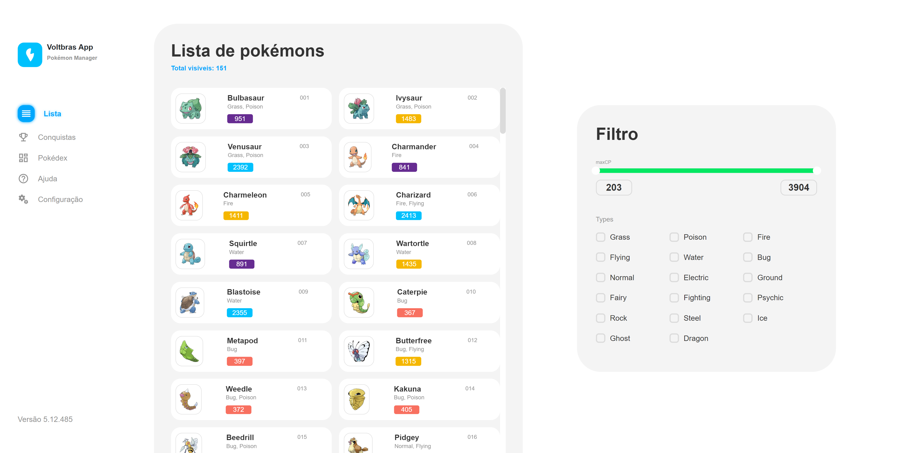
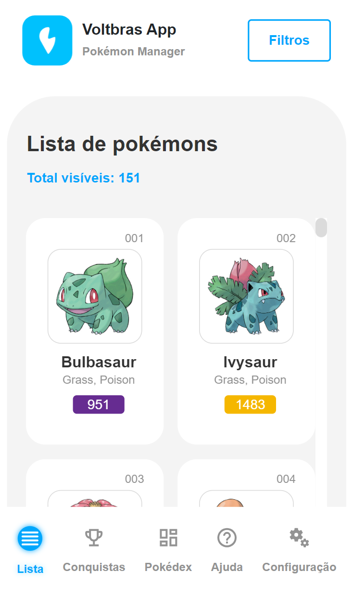

<h1 align="center">
  <br>
  <a href="#"></a>
  <br>
  Voltbras App
  <br>
</h1>

<h4 align="center">A minimal project to take data from a pokemons api and upload to the site, applying some filters..</h4>

<p align="center">
  <a href="#">
    
  </a>
</p>

<p align="center">
  <a href="#key-features">Key Features</a> •
  <a href="#how-to-use">How To Use</a> •
  <a href="#license">License</a>
</p>

<div style="display:grid; grid-template-columns: 1fr 250px; gap:12px;">
 
   
</div>

## Key Features

- Create a landing page using the React framework consuming the API data displaying the list of pokemons.
- Implement an option to filter the results of the pokemon list.
  - Filter by pokémon type (types);
    `ex: Grass => returns all pokemons that are Grass type;`
    `ex: Grass + Water => returns all pokemons that are Grass type OR Water type.`
  - Filter by max CP (maxCP) - ex: "800" => returns all pokemons that have 800 maxCP or more than that.
  - Filter by type and max CP - `ex: "Type: Water + Grass; 100 < maxCP < 500" => returns all pokemons that are Grass type OR Water type AND whose maxCP is between 100 and 500;`
- Adapt the page for mobile devices (make it responsive)
- Add tests using [Jest] or any other testing framework;
- Implement lazy loading;
- Host the landing page on a service without having to run it locally;

## How To Use

To clone and run this application, you'll need [Git](https://git-scm.com) and [Node.js](https://nodejs.org/en/download/) (which comes with [npm](http://npmjs.com)) installed on your computer. From your command line:

```bash
# Clone this repository
$ git clone https://github.com/herlanderbento/voltbras-poke-app.git

# Go into the repository
$ cd voltbras-poke-app

# Install dependencies
$ npm install

# Run the app
$ npm run dev
```

> **Note**
> Don't forget to follow the recommendations above.

## Watch a video with an explanation

Here is the link with a brief explanation of the functionality of the project in general, the challenges and the achievements: [Watch here](https://khan.github.io/KaTeX/)

## Credits

This software uses the following open source packages:

- [Node.js](https://nodejs.org/)
- [Reactjs](https://react.dev/)
- [Vitest](https://vitest.dev/)
- [Apollo Client](https://www.apollographql.com/docs/react/)
- [Bootstrap](https://getbootstrap.com/)
- [Rc-Slider](https://www.npmjs.com/package/rc-slider)

## You may also like...

Follow my github profile and found another projects I've built.

> GitHub [@herlanderbento](https://github.com/herlanderbento) &nbsp;&middot;&nbsp;

## Developed By

Herlander Bento
